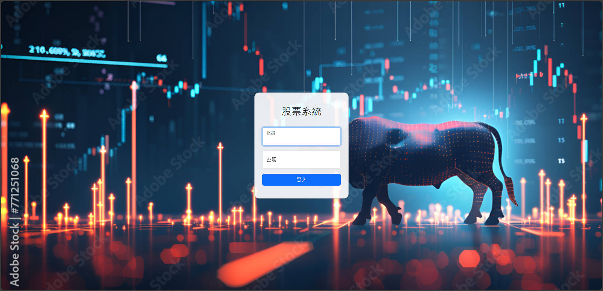
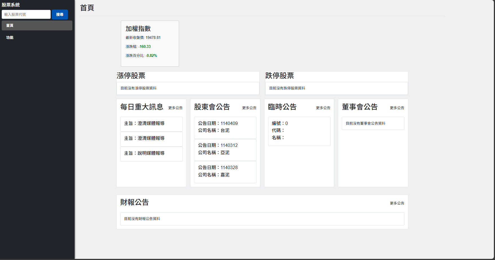
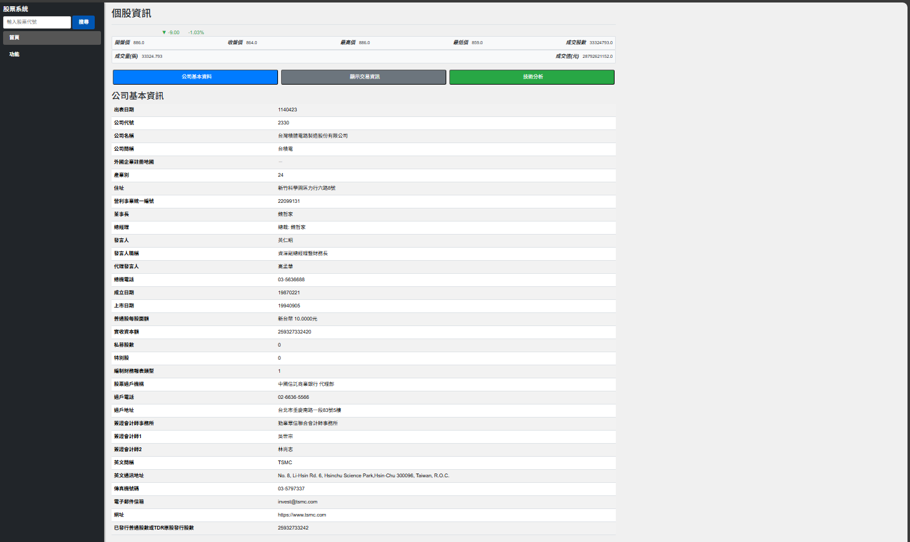
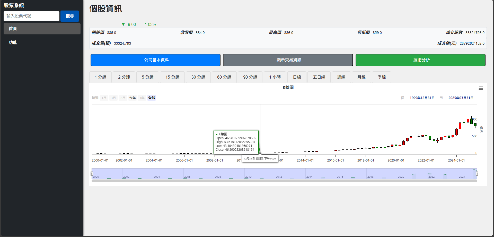

# 股票資訊系統 (Stock Information System) 待更新

這是一個使用 Python Flask 框架開發的網頁應用程式，旨在提供使用者查詢台灣股市相關資訊、市場新聞公告以及個股分析工具。此專案整合了多個公開資料來源，提供一個集中化的資訊平台，適合展示全端開發能力。

## 系統畫面展示

### 登入畫面

*系統登入介面，提供安全的用戶認證。*

### 首頁

*登入後的主畫面，整合顯示市場概況、新聞公告及個股查詢入口。*

### 個股概況


### 技術分析


## 主要功能 (Key Features)

*   **用戶認證系統 (User Authentication):**
    *   提供安全的登入與登出機制 (使用 **Flask-Login** 進行會話管理)。
    *   使用 **bcrypt** 對使用者密碼進行安全的雜湊加密儲存。
*   **個股資訊查詢 (Stock Information Query):**
    *   顯示上市/上櫃/興櫃公司基本資料（如：董事長、總經理、實收資本額等）。
    *   展示即時與歷史交易資訊（開盤、收盤、最高、最低、成交量等）。
*   **互動式 K 線圖 (Interactive K-Line Charts):**
    *   視覺化呈現股票歷史價格走勢。
    *   支援不同時間區間（日、週、月）的數據查詢與顯示。
    *   使用 **[請確認是 ECharts 還是 Highcharts]** 實現豐富的圖表互動。
*   **市場新聞與公告 (Market News & Announcements):**
    *   即時獲取並展示台灣證券交易所發布的重大訊息、臨時公告、注意處置股票等。
    *   整合加權指數等市場概況資訊，方便使用者掌握市場動態。
*   **多重資料來源整合 (Multi-Source Data Integration):**
    *   **台灣證券交易所 (TWSE):** 透過官方 API 獲取新聞、公告等官方資訊。
    *   **Yahoo Finance:** 利用 `yfinance` 套件獲取個股歷史股價及部分即時數據。
    *   **櫃檯買賣中心 (TPEx):** 透過網頁爬蟲 (**Selenium** + **BeautifulSoup4**) 獲取尚無官方 API 的上櫃/興櫃股票代碼清單。
    *   實現簡單的資料更新檢查機制 (`is_data_up_to_date`)，確保部分本地資料的時效性。
*   **響應式網頁設計 (Responsive Web Design):**
    *   使用 **Bootstrap 5** 框架，確保在不同尺寸的裝置（桌面、平板、手機）上皆有良好的瀏覽體驗。

## 技術棧 (Technology Stack)

此專案採用了現代化的 Web 開發技術組合，旨在實現功能完整、易於維護且具備良好使用者體驗的目標。

*   **後端 (Backend):**
    *   **Python 3.11:** 主要開發語言。
    *   **Flask:** 輕量級 WSGI Web 框架，選擇它因其靈活性高、學習曲線平緩，適合快速開發原型及中小型應用。
    *   **SQLAlchemy:** 強大的 ORM (Object-Relational Mapper)，用於將 Python 物件與資料庫表格進行映射，簡化資料庫操作，提高開發效率。
    *   **Flask-Login:** 處理使用者登入、登出及會話管理，提供方便的認證功能。
    *   **Flask-WTF:** 整合 WTForms，用於處理網頁表單、驗證使用者輸入及提供 CSRF 保護，增強安全性。
    *   **Requests:** 用於發送 HTTP 請求，與外部 API (如 TWSE API) 進行互動。
    *   **Selenium & BeautifulSoup4:** 用於網頁爬蟲，自動化抓取櫃買中心等網站上沒有提供 API 的公開資料。
    *   **Bcrypt:** 用於密碼雜湊，確保使用者密碼不以明文形式儲存，提升帳戶安全性。
*   **前端 (Frontend):**
    *   **HTML5:** 網頁結構標準。
    *   **CSS3:** 網頁樣式設計，包含自訂樣式與 **Bootstrap 5** 框架提供的樣式。
    *   **JavaScript (ES6+):** 實現前端互動邏輯，如圖表繪製、動態內容加載等。
    *   **jQuery:** 廣泛使用的 JavaScript 函式庫，簡化 DOM 操作和事件處理 (雖然現代開發趨向原生 JS 或其他框架，但此專案仍有使用)。
    *   **[請確認是 ECharts 還是 Highcharts]:** 強大的圖表庫，用於視覺化股票 K 線圖等複雜數據，提供互動式圖表體驗。 *(請務必在此處確認並填寫您實際使用的圖表庫)*
    *   **AJAX/Fetch API:** 用於實現非同步資料請求，例如在不重新載入整個頁面的情況下更新股價、載入 K 線圖數據，提升使用者體驗。
*   **資料庫 (Database):**
    *   **SQL Server:** 關係型資料庫，用於儲存使用者帳號等結構化資料 (根據 `config.py` 設定)。
*   **開發工具與環境 (Development Tools & Environment):**
    *   **Git:** 版本控制系統，用於追蹤程式碼變更與協作。
    *   **Virtual Environment (`venv`):** Python 的標準工具，用於建立獨立的專案環境，隔離套件依賴。
    *   **IDE:** Visual Studio Code。

## 系統架構 (System Architecture)

*   採用 **Flask Blueprint** 組織路由與視圖，將應用程式劃分為不同功能模組（如會員中心 `mc`、API `fastapi` 等），提高程式碼的可讀性與可維護性。
*   整體設計遵循 **關注點分離 (Separation of Concerns)** 原則，類似於 **MVC (Model-View-Controller)** 或 **MVVM (Model-View-ViewModel)** 的概念，將資料處理 (Model)、業務邏輯 (Controller/ViewModel) 與使用者介面 (View/Template) 分開。
*   前後端主要透過 **AJAX/Fetch API** 請求結合 **Jinja2 模板引擎渲染** 的方式進行資料交換與頁面生成。部分功能可能也提供了 **RESTful API** 端點 (如 FastAPI 部分)。
*   透過 `config.py` 集中管理應用程式配置，如資料庫連線字串、外部 API 金鑰等敏感資訊，並建議透過 **環境變數** 加載以提高安全性。
*   使用 `exts.py` 統一初始化和管理 Flask 擴充套件實例，避免循環引用問題。

## 資料來源 (Data Sources)

*   **台灣證券交易所 (TWSE) 開放 API:** 提供官方的市場公告、新聞等結構化資料。
*   **Yahoo Finance API (透過 `yfinance`):** 提供廣泛的個股歷史價格、交易量及部分基本面數據。是國際上常用的金融數據來源之一。
*   **櫃檯買賣中心 (TPEx) 網站:** 透過網頁爬蟲獲取上櫃/興櫃的股票代碼等資訊，作為 API 資料的補充。

## 如何運行 (How to Run)

1.  **克隆儲存庫:**
    ```
    git clone [https://github.com/Hon0403/stock.git]
    cd [stock]
    ```
2.  **建立並啟動虛擬環境:**
    ```
    python -m venv venv
    # Windows
    venv\Scripts\activate
    # macOS/Linux
    source venv/bin/activate
    ```
3.  **安裝所需的 Python 套件:**
    ```
    pip install -r requirements.txt  # 確保您有 requirements.txt 檔案
    # 或者手動安裝主要套件
    # pip install Flask SQLAlchemy Flask-Login Flask-WTF requests selenium beautifulsoup4 bcrypt yfinance ...
    ```
4.  **(若使用 Selenium) 安裝 ChromeDriver:** 確保您的系統已安裝與 Chrome 瀏覽器版本匹配的 ChromeDriver，或使用 `webdriver-manager` 自動管理。
5.  **設定環境變數:** 參考 `config.py`，設定必要的環境變數，例如：
    *   `DATABASE_URL` (SQL Server 連線字串)
    *   `SECRET_KEY` (Flask 的安全密鑰)
    *   `FUGLE_KEY` (如果 Fugle API 被積極使用)
    *   ... 其他可能的 API 金鑰或配置
6.  **(可選) 初始化資料庫:** 如果您的模型有變更，可能需要運行資料庫遷移指令 (如果您使用了 Flask-Migrate) 或手動創建表格。
7.  **(可選) 運行爬蟲腳本:** 首次運行或需要更新股票代碼列表時，可能需要執行相關的爬蟲腳本 (如 `fetch_tpex_stocks.py`)。
8.  **運行 Flask 應用程式:**
    ```
    flask run
    # 或者
    python app.py
    ```
9.  在瀏覽器中開啟 `http://127.0.0.1:5000` (或其他指定的地址與端口)。

## 測試帳號 (Test Account)

為方便評估系統功能，可使用以下測試帳號登入：

*   **帳號：** `12`
*   **密碼：** `12`

*注意：此為測試帳號，僅供功能展示使用。在實際部署環境中，應強制使用者設定強密碼並實施更完善的安全機制。*

## 目前未完成/規劃中功能

*   **漲跌停資訊:** 相關 API 已串接但前端頁面顯示功能尚未完全整合完成。
*   **個股技術指標分析:** 規劃中，未來可考慮在 K 線圖上疊加 MACD、RSI、均線等常用技術指標。
*   **行動裝置介面優化:** 目前使用 Bootstrap 實現基礎響應式，但部分複雜表格或圖表在小螢幕上的體驗可進一步優化。
*   **使用者功能:** 目前登入畫面未實作「忘記密碼」與「註冊新帳號」功能。
*   **效能優化:** 對於頻繁請求的 API 資料可考慮加入快取機制 (如 Redis 或 Flask-Caching) 以提升回應速度並減少 API 請求次數。
*   **錯誤處理與日誌:** 可進一步細化錯誤處理邏輯，並完善日誌記錄，方便追蹤問題。

